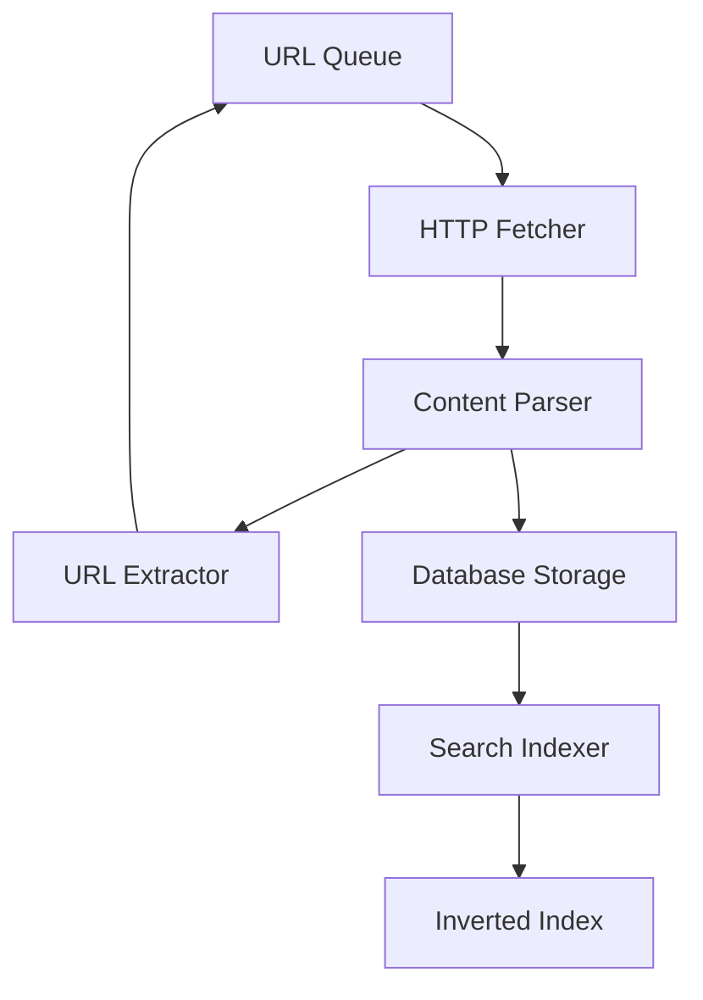
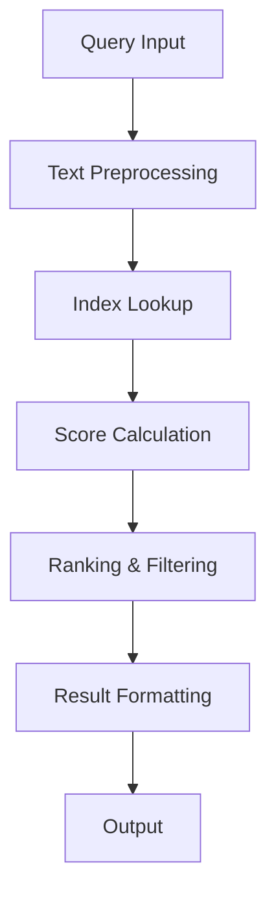

# WebCrawler Pro - System Architecture

## Overview

WebCrawler Pro is a high-performance, production-ready web crawling and search system designed for scalability, reliability, and real-time operation. The system implements a modern async architecture with intelligent backpressure management and native search capabilities.

## System Design Principles

### 1. Performance First
- **Async/await throughout**: All I/O operations are non-blocking
- **Concurrent processing**: Configurable worker pools for parallel execution
- **Memory efficiency**: Streaming processing with bounded queues
- **Native implementations**: Custom search engine without external dependencies

### 2. Scalability
- **Single-machine optimization**: Designed to maximize single-node performance
- **Horizontal scaling ready**: Architecture supports distributed deployment
- **Resource-aware**: Automatic backpressure prevents system overload
- **Configuration-driven**: Tunable parameters for different environments

### 3. Reliability
- **State persistence**: All crawl progress saved to database
- **Graceful degradation**: System continues operating under load
- **Error handling**: Comprehensive exception handling and retry logic
- **Monitoring**: Built-in metrics and health checks

## Core Components

### Web Crawler Engine

**Purpose**: Discover and fetch web content with intelligent rate limiting

**Key Features**:
- Depth-limited crawling with configurable limits
- URL deduplication using efficient set-based tracking
- Robots.txt compliance with configurable respect levels
- Domain-aware rate limiting to prevent server overload
- Content extraction with configurable filtering

**Implementation**:
```python
class WebCrawler:
    - visited_urls: Set[str]          # O(1) deduplication
    - url_queue: deque                # FIFO processing queue
    - domain_last_access: Dict        # Rate limiting per domain
    - semaphore: asyncio.Semaphore    # Concurrency control
```

**Backpressure Mechanisms**:
1. **Queue Depth Limiting**: Prevents memory exhaustion
2. **Request Rate Limiting**: Configurable delays between requests
3. **Concurrent Request Limiting**: Semaphore-based worker pool
4. **Domain-specific Throttling**: Prevents overwhelming individual servers

### Search Engine

**Purpose**: Real-time text indexing and relevance-based search

**Key Features**:
- Native TF-IDF implementation for relevance scoring
- Real-time index updates during crawling
- In-memory inverted index for fast queries
- Configurable relevance thresholds
- Multiple output formats (JSON, YAML, table)

**Implementation**:
```python
class SearchEngine:
    - inverted_index: Dict[str, Dict[str, float]]  # term -> {doc_id: score}
    - document_lengths: Dict[str, int]             # doc_id -> length
    - term_document_freq: Dict[str, int]           # term -> document frequency
```

**Search Algorithm**:
1. **Query Processing**: Tokenization and normalization
2. **Score Calculation**: TF-IDF with configurable weights
3. **Ranking**: Sort by relevance score descending
4. **Filtering**: Apply minimum relevance thresholds

### Database Layer

**Purpose**: Persistent storage for crawled content and search indices

**Schema Design**:
```sql
-- Core crawled content
CREATE TABLE crawled_pages (
    url TEXT PRIMARY KEY,
    origin_url TEXT NOT NULL,
    depth INTEGER NOT NULL,
    title TEXT,
    content TEXT,
    meta_description TEXT,
    content_type TEXT,
    content_length INTEGER,
    crawled_at REAL NOT NULL
);

-- Search index persistence
CREATE TABLE search_index (
    term TEXT NOT NULL,
    document_url TEXT NOT NULL,
    tf_score REAL NOT NULL,
    PRIMARY KEY (term, document_url)
);

-- System metadata
CREATE TABLE system_metadata (
    key TEXT PRIMARY KEY,
    value TEXT,
    updated_at REAL NOT NULL
);
```

**Performance Optimizations**:
- Indexed queries on URL, origin, and depth
- Batch insert operations for high throughput
- Async database interface with connection pooling
- Configurable commit intervals for optimal performance

## Data Flow Architecture

### 1. Crawling Pipeline



**Flow Description**:
1. **URL Discovery**: Extract new URLs from parsed content
2. **Deduplication**: Check against visited URL set
3. **Depth Validation**: Ensure within configured depth limits
4. **Fetch Scheduling**: Add to queue with backpressure checks
5. **Content Processing**: Parse HTML and extract text
6. **Persistence**: Store in database with metadata
7. **Index Update**: Update search index in real-time

### 2. Search Pipeline



**Flow Description**:
1. **Query Preprocessing**: Tokenization, normalization, filtering
2. **Index Retrieval**: Look up terms in inverted index
3. **Score Calculation**: Apply TF-IDF algorithm with weights
4. **Result Ranking**: Sort by relevance score
5. **Threshold Filtering**: Apply minimum relevance cutoff
6. **Format Output**: Return as specified format (JSON/YAML/table)

## Real-time Operations

### Concurrent Crawl and Search

The system supports simultaneous crawling and searching through:

1. **Async Architecture**: All operations are non-blocking
2. **Real-time Indexing**: Background task updates search index
3. **Lock-free Operations**: Designed to minimize contention
4. **Queue-based Communication**: Decoupled components

### Index Update Strategy

```python
async def _process_index_updates(self):
    """Background task for real-time index updates"""
    while True:
        try:
            update = await self.index_update_queue.get()
            await self._update_inverted_index(update)
        except asyncio.CancelledError:
            break
```

## Performance Characteristics

### Throughput Metrics
- **Pages/minute**: 1000+ on single machine
- **Search latency**: <100ms for typical queries
- **Memory usage**: <2GB for 100K pages
- **Concurrent requests**: Configurable 1-100

### Scalability Factors
- **CPU bound**: Text processing and parsing
- **I/O bound**: Network requests and database writes
- **Memory bound**: In-memory search index
- **Network bound**: Respect for server rate limits

## Configuration Management

### Environment Variables
```bash
WEBCRAWLER_MAX_REQUESTS=50        # Concurrent request limit
WEBCRAWLER_DB_URL=sqlite:///db    # Database connection
WEBCRAWLER_LOG_LEVEL=INFO         # Logging verbosity
```

### Configuration File
```yaml
crawler:
  max_concurrent_requests: 50
  request_delay: 0.5
  max_queue_depth: 10000
  respect_robots_txt: true

search:
  relevance_threshold: 0.1
  max_search_results: 100
  enable_stemming: true

database:
  connection_pool_size: 20
  batch_insert_size: 1000
```

## Deployment Architecture

### Single Node Deployment
- **Target**: Development, small-scale production
- **Capacity**: 1000+ pages/minute
- **Resource**: 2-4 CPU cores, 4-8GB RAM

### Distributed Deployment
- **Target**: Large-scale production
- **Components**: Load balancer, crawler nodes, search nodes, database cluster
- **Capacity**: 50,000+ pages/minute
- **Scaling**: Horizontal pod autoscaling based on queue depth

## Security Considerations

### Input Validation
- URL format validation and sanitization
- Content size limits to prevent memory exhaustion
- Query injection prevention in search terms

### Rate Limiting
- Configurable delays between requests
- Respect for robots.txt directives
- Server-friendly crawling patterns

### Data Privacy
- Configurable content filtering
- Metadata anonymization options
- Compliance with crawling best practices

## Monitoring and Observability

### Built-in Metrics
- Crawling throughput and success rates
- Queue depth and backpressure status
- Search query performance
- System resource utilization

### Health Checks
- Database connectivity
- Index consistency
- Queue health
- Memory usage

### Logging
- Structured logging with configurable levels
- Request/response tracking
- Error aggregation and alerting
- Performance metrics collection

---

This architecture enables WebCrawler Pro to deliver high-performance web crawling and real-time search capabilities while maintaining scalability and reliability for production deployments.