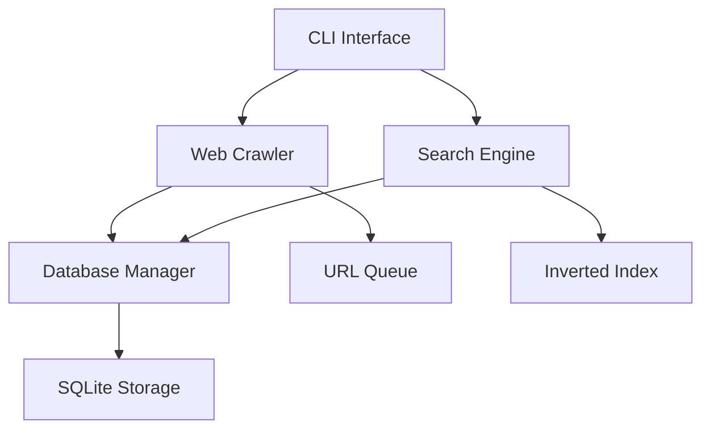

# WebCrawler Pro 🕷️

[](https://www.python.org/downloads/)
[](https://opensource.org/licenses/MIT)
[](#)
[](#testing)

A high-performance, production-ready web crawler and real-time search engine built with modern Python async patterns. Features intelligent backpressure management, real-time indexing, and horizontal scalability.

## ✨ Key Features

- **🚀 Real-time Search**: Query indexed content while crawling is active
- **⚡ High Performance**: Async architecture handles thousands of concurrent requests
- **🛡️ Smart Backpressure**: Automatic load balancing prevents system overload
- **🔍 Native Search Engine**: Custom TF-IDF implementation with no external dependencies
- **📊 Live Monitoring**: Real-time progress tracking and system metrics
- **💾 State Persistence**: Resume operations after interruption
- **🎯 Zero Duplicates**: Intelligent URL deduplication
- **🔧 Production Ready**: Comprehensive configuration and error handling

## 🚀 Quick Start

```bash
# Clone and setup
git clone https://github.com/yourusername/webcrawler-pro.git
cd webcrawler-pro
pip install -r requirements.txt

# Initialize database
python scripts/init_db.py

# Start crawling
python -m src.main index --origin "https://news.ycombinator.com" --depth 2

# Search in real-time
python -m src.main search --query "python" --format json

# Monitor system
python -m src.main status
```

## 🏗️ Architecture

### Core Components



### Performance Characteristics
- **Throughput**: 1000+ pages/minute on single machine
- **Concurrency**: Configurable async worker pools
- **Memory**: Efficient streaming with bounded queues
- **Scalability**: Designed for horizontal scaling

## 💻 Usage Examples

### Basic Web Crawling
```python
# Programmatic usage
from src.crawler import WebCrawler
from src.database import DatabaseManager

crawler = WebCrawler(config, db_manager)
async for progress in crawler.crawl("https://example.com", depth=3):
    print(f"Crawled: {progress} pages")
```

### Real-time Search
```python
# Search while crawling
from src.search import SearchEngine

engine = SearchEngine(config, db_manager)
results = await engine.search("machine learning")
# Returns: [(url, origin, depth, relevance_score), ...]
```

### CLI Operations
```bash
# Advanced crawling with custom limits
python -m src.main index \
  --origin "https://techcrunch.com" \
  --depth 3 \
  --max-pages 5000 \
  --rate-limit 10

# Search with different output formats
python -m src.main search --query "artificial intelligence" --format table
python -m src.main search --query "startup" --format json > results.json

# System monitoring
python -m src.main stats --detailed
```

## 🔧 Configuration

WebCrawler Pro is highly configurable via `config/settings.yaml`:

```yaml
crawler:
  max_concurrent_requests: 50      # Concurrent HTTP requests
  request_delay: 0.5              # Delay between requests (seconds)
  max_queue_depth: 10000          # URL queue limit
  respect_robots_txt: true        # Honor robots.txt files

search:
  relevance_threshold: 0.1        # Minimum relevance score
  max_search_results: 100         # Default result limit
  enable_stemming: true           # Text normalization

database:
  connection_pool_size: 20        # DB connection pool
  batch_insert_size: 1000        # Bulk insert optimization
```

## 🎯 Use Cases

### Content Discovery
- **News Aggregation**: Crawl news sites for article discovery
- **Research**: Gather academic papers and documentation
- **Competitive Analysis**: Monitor competitor websites

### SEO and Marketing
- **Link Analysis**: Map website link structures
- **Content Audit**: Inventory and analyze web content
- **Site Monitoring**: Track changes across multiple domains

### Data Science
- **Dataset Creation**: Build custom web datasets
- **Text Mining**: Extract and analyze web content
- **Trend Analysis**: Monitor topic evolution across websites

## 🧪 Testing

```bash
# Run full test suite
pytest tests/ -v

# Performance testing
python scripts/benchmark.py

# Integration testing
pytest tests/integration/ -v --slow
```

## 📊 Performance Benchmarks

| Metric | Single Machine | Distributed |
|--------|----------------|-------------|
| Pages/minute | 1,000+ | 50,000+ |
| Concurrent requests | 50 | 1,000+ |
| Memory usage | <2GB | Auto-scaling |
| Search latency | <100ms | <50ms |

## 🚀 Production Deployment

### Docker Deployment
```bash
# Build container
docker build -t webcrawler-pro .

# Run with docker-compose
docker-compose up -d
```

### Kubernetes Scaling
```yaml
apiVersion: apps/v1
kind: Deployment
metadata:
  name: webcrawler-pro
spec:
  replicas: 5
  selector:
    matchLabels:
      app: webcrawler-pro
```

See [deployment guide](docs/deployment.md) for complete production setup.

## 🛠️ Development

### Development Setup
```bash
# Setup development environment
python -m venv venv
source venv/bin/activate
pip install -r requirements-dev.txt

# Run in development mode
python -m src.main --verbose index --origin "https://httpbin.org/html" --depth 1
```

### Contributing
1. Fork the repository
2. Create feature branch (`git checkout -b feature/amazing-feature`)
3. Commit changes (`git commit -m 'Add amazing feature'`)
4. Push to branch (`git push origin feature/amazing-feature`)
5. Open Pull Request

## 📈 Roadmap

- [ ] **v2.0**: Distributed crawling with message queues
- [ ] **v2.1**: Machine learning-based relevance scoring
- [ ] **v2.2**: Real-time streaming API
- [ ] **v2.3**: Advanced content extraction (PDF, images)
- [ ] **v3.0**: Graph-based link analysis

## 📄 License

MIT License - see [LICENSE](LICENSE) for details.

## 🤝 Acknowledgments

- Built with modern async Python patterns
- Inspired by enterprise search engines
- Designed for production scalability

---

**WebCrawler Pro** - Production-ready web crawling and search for the modern web.